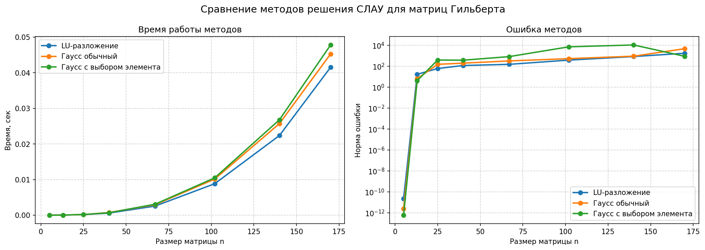

# matrix-solving

Сравнение методов решения СЛАУ на матрицах Гильберта:

- LU-разложение
- Метод Гаусса
- Метод Гаусса с выбором главного элемента

Скрипт [matrix_solving.py](matrix_solving.py) измеряет время работы и ошибку для разных размеров матриц, после чего строит итоговый график через `matplotlib`.

## Результат



## Запуск

```bash
pip install -r requirements.txt
python3 matrix_solving.py
```
